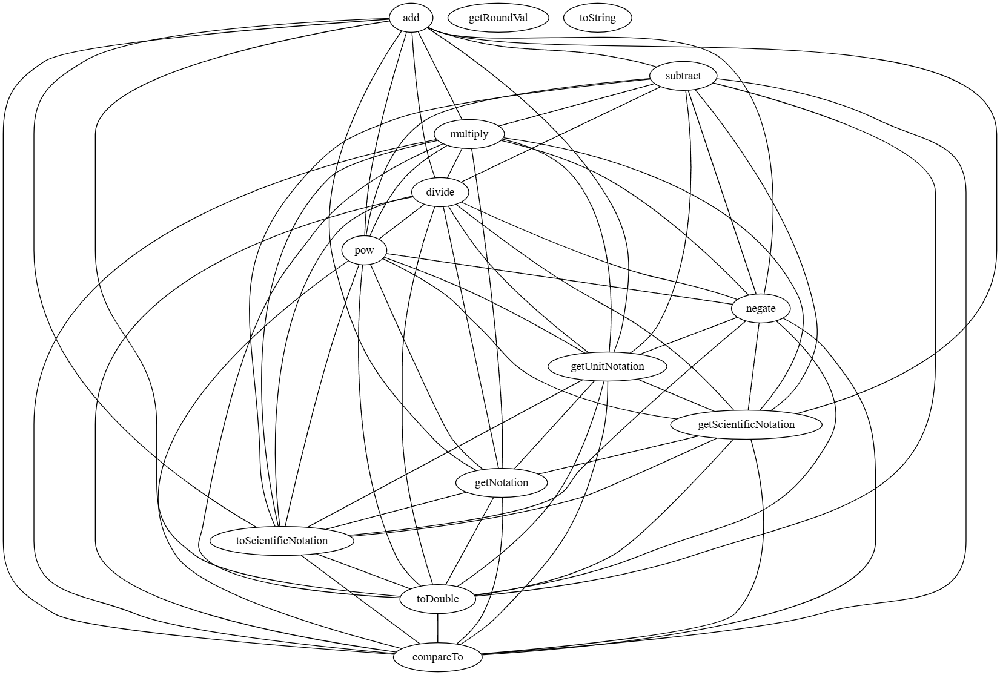
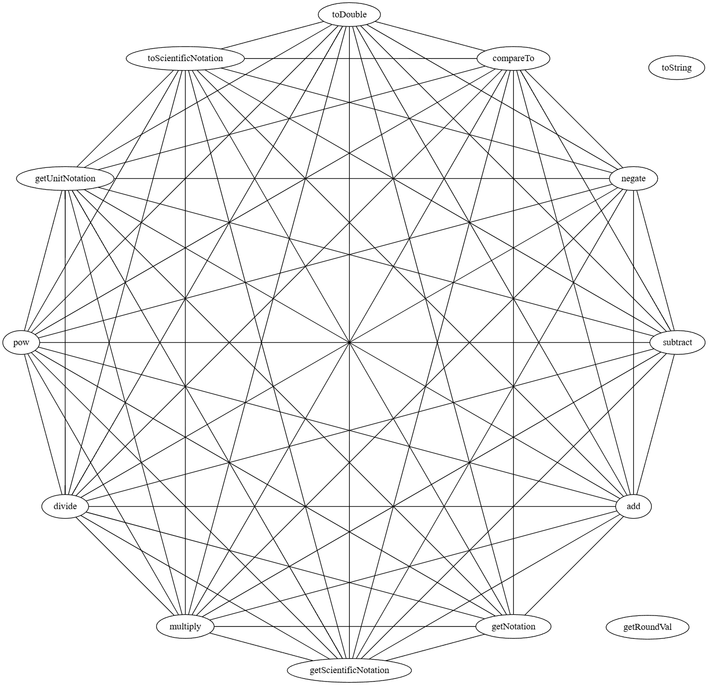

# Class cohesion with JavaParser

With the help of JavaParser implement a program that computes the Tight Class Cohesion (TCC) for each class in a given Java project. The program should take as input the path to the source code of the project. It should produce a report in the format of your choice (TXT, CSV, Markdown, HTML, etc.) containing a table showing for each class: the package, name and TCC value. 
Your application should also produce a histogram showing the distribution of CC values in the project. Compare the histogram of two or more projects.
Finally, your application should also produce the dependency graph of each class (cf. example [here](https://people.irisa.fr/Benoit.Combemale/pub/course/vv/vv-textbook-v0.1.pdf#cohesion-graph)). The graph should be written using the [GraphViz DOT format](https://www.graphviz.org/)

Ignore inherited members to compute TCC of a class.

Include in this repository the code of your application. Remove all unnecessary files like compiled binaries. Do include the reports and plots you obtained from different projects. See the [instructions](../sujet.md) for suggestions on the projects to use.

You may use [javaparser-starter](../code/javaparser-starter) as a starting point.

## Answer

You can find the code (with comments) to answer to this exercise in the code repertory.

We tested our code by using the two examples in the [textbook by Oscar Luis Vera-Pérez](https://oscarlvp.github.io/vandv-classes/) (Listing 16 and 18). The three examples return the right result. You can also find the code in the code/example/EX5 repository.

We obtained the reports (present in code/exercise6/reports) from the examples and 4 projects (commons-collections, commons-cli, commons-lang and malo-project) by executing the same commands as before.

You can also view the associated histograms (made thanks to the same way as before) in code/exercise6/histograms for the four projects. Let's compare them by observing the histograms and the output of this program :

``` text
=== MaloProject ===
Number of classes with a TCC value of NaN: 14 (= 22.6%)

Number of classes with TCC between 0.0 and 0.05: 41 (= 85.4%)
Number of classes with TCC between 0.05 and 0.1: 3 (= 6.2%)
Number of classes with TCC between 0.1 and 0.2: 3 (= 6.2%)
Number of classes with TCC between 0.2 and 0.5: 1 (= 2.1%)
Number of classes with TCC between 0.5 and 1.0: 0 (= 0.0%)

Number of classes with a TCC value equal to 0: 37
Number of classes with a TCC value equal to 1: 0


=== CommonsCollections ===
Number of classes with a TCC value of NaN: 40 (= 11.6%)

Number of classes with TCC between 0.0 and 0.05: 306 (= 100.0%)
Number of classes with TCC between 0.05 and 0.1: 0 (= 0.0%)
Number of classes with TCC between 0.1 and 0.2: 0 (= 0.0%)
Number of classes with TCC between 0.2 and 0.5: 0 (= 0.0%)
Number of classes with TCC between 0.5 and 1.0: 0 (= 0.0%)

Number of classes with a TCC value equal to 0: 303
Number of classes with a TCC value equal to 1: 0

=== CommonsCli ===
Number of classes with a TCC value of NaN: 6 (= 22.2%)

Number of classes with TCC between 0.0 and 0.05: 21 (= 100.0%)
Number of classes with TCC between 0.05 and 0.1: 0 (= 0.0%)
Number of classes with TCC between 0.1 and 0.2: 0 (= 0.0%)
Number of classes with TCC between 0.2 and 0.5: 0 (= 0.0%)
Number of classes with TCC between 0.5 and 1.0: 0 (= 0.0%)

Number of classes with a TCC value equal to 0: 20
Number of classes with a TCC value equal to 1: 0


=== CommonsLang ===
Number of classes with a TCC value of NaN: 63 (= 24.6%)

Number of classes with TCC between 0.0 and 0.05: 180 (= 93.3%)
Number of classes with TCC between 0.05 and 0.1: 4 (= 2.1%)
Number of classes with TCC between 0.1 and 0.2: 4 (= 2.1%)
Number of classes with TCC between 0.2 and 0.5: 5 (= 2.6%)
Number of classes with TCC between 0.5 and 1.0: 0 (= 0.0%)

Number of classes with a TCC value equal to 0: 170
Number of classes with a TCC value equal to 1: 0
```


In the results, we can notice that some classes may have a TCC value of NaN. It is related to the fact that classes may not have 0 or 1 method, so the calculation will be divided by 0.

After that, we just fixed it by setting the maximum number of possible connections value to 1.

Then we added the Graphviz implementation.

So under the TCC score, you will find in the report the graph visualization.
```
Optional[me.astri.idleBot.GameBot.entities.BigNumber] : 0.33684212
strict graph {add;add -- subtract;add -- multiply;add -- divide;add -- pow;add -- negate;add -- getUnitNotation;add -- getScientificNotation;add -- getNotation;add -- toScientificNotation;add -- toDouble;add -- compareTo;subtract;subtract -- multiply;subtract -- divide;subtract -- pow;subtract -- negate;subtract -- getUnitNotation;subtract -- getScientificNotation;subtract -- toScientificNotation;subtract -- toDouble;subtract -- compareTo;multiply;multiply -- divide;multiply -- pow;multiply -- negate;multiply -- getUnitNotation;multiply -- getScientificNotation;multiply -- getNotation;multiply -- toScientificNotation;multiply -- toDouble;multiply -- compareTo;divide;divide -- pow;divide -- negate;divide -- getUnitNotation;divide -- getScientificNotation;divide -- getNotation;divide -- toScientificNotation;divide -- toDouble;divide -- compareTo;pow;pow -- negate;pow -- getUnitNotation;pow -- getScientificNotation;pow -- getNotation;pow -- toScientificNotation;pow -- toDouble;pow -- compareTo;negate;negate -- getUnitNotation;negate -- getScientificNotation;negate -- toScientificNotation;negate -- toDouble;negate -- compareTo;add;subtract;multiply;divide;pow;negate;getRoundVal;getUnitNotation;getUnitNotation -- getScientificNotation;getUnitNotation -- getNotation;getUnitNotation -- toScientificNotation;getUnitNotation -- toDouble;getUnitNotation -- compareTo;getScientificNotation;getScientificNotation -- getNotation;getScientificNotation -- toScientificNotation;getScientificNotation -- toDouble;getScientificNotation -- compareTo;toString;getNotation;getNotation -- toScientificNotation;getNotation -- toDouble;getNotation -- compareTo;toScientificNotation;toScientificNotation -- toDouble;toScientificNotation -- compareTo;toDouble;toDouble -- compareTo;compareTo;}
```
With Dot engine


With circo engine
