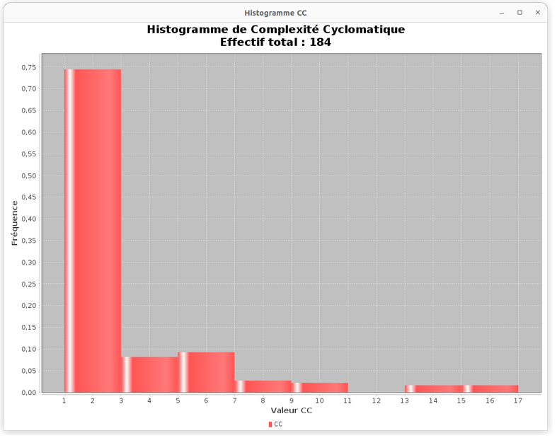
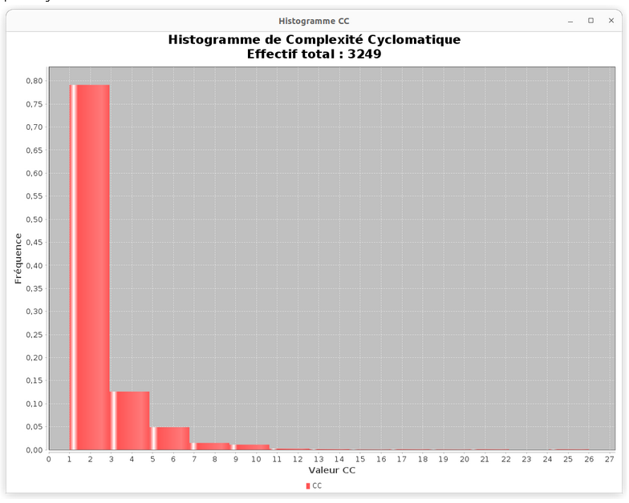

# Cyclomatic Complexity with JavaParser

With the help of JavaParser implement a program that computes the Cyclomatic Complexity (CC) of all methods in a given Java project. The program should take as input the path to the source code of the project. It should produce a report in the format of your choice (TXT, CSV, Markdown, HTML, etc.) containing a table showing for each method: the package and name of the declaring class, the name of the method, the types of the parameters and the value of CC.
Your application should also produce a histogram showing the distribution of CC values in the project. Compare the histogram of two or more projects.

Include in this repository the code of your application. Remove all unnecessary files like compiled binaries. Do include the reports and plots you obtained from different projects. See the [instructions](../sujet.md) for suggestions on the projects to use.

You may use [javaparser-starter](../code/javaparser-starter) as a starting point.

## [Answer](./Exercice_Complexite_Cyclo/output.csv)

Histogramme de complexité cyclomatique du projet Apache Commons Math :

Histogramme de complexité cyclomatique du projet Apache Commons Lang :

On constate sur ces histogrammes que la complexité cyclomatique est la plupart du temps comprise entre 1 et 3 (~75+% dans les deux projets). Malgré un effectif plus faible pour le projet Math on constate tout de même une répartition similaire.

La complexité la plus forte pour le projet Math est comprise entre 15 et 17, tandis que pour le projet Lang elle est comprise entre 24 et 26.

PS: Pour obtenir le nombre exact de fonctions ayant une complexité cyclomatique comprise dans un certain intervalle, il suffit de multiplier la fréquence de l'intervalle par l'effectif total.
