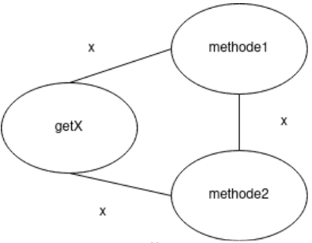

# TCC *vs* LCC

Explain under which circumstances *Tight Class Cohesion* (TCC) and *Loose Class Cohesion* (LCC) metrics produce the same value for a given Java class. Build an example of such as class and include the code below or find one example in an open-source project from Github and include the link to the class below. Could LCC be lower than TCC for any given class? Explain.

A refresher on TCC and LCC is available in the [course notes](https://oscarlvp.github.io/vandv-classes/#cohesion-graph).

## Answer

Pour calculer la TCC et la LCC, on construit un graphe représentant les méthodes dans les nœuds et les arêtes relient les nœuds ayant des attributs en commun.

Pour calculer la TCC, on divise le nombre de méthodes ayant un attribut commun par le nombre de paires de méthodes.

Pour la LCC, il faut compter tous les nœuds qui sont reliés entre eux même de manière indirecte aussi divisée par le nombre de paires de méthodes.

```java
class Test {
   private int x;


   Test(int x){
       this.x = x;
   }


   public int getX(){
       return this.x;
   }


   public String methode1(){
       return "Je suis la méthode 1 et j'utilise x: " + this.x;
   }


   public String methode2(){
       return "Je suis la méthode 2 et j'utilise x: " + this.x;
   }
}
```

Ainsi nous avons ici trois méthodes donc notre graphe comportera trois nœuds. Aussi toutes nos méthodes utilisent le même attribut x. On peut le représenter grâce au graphe ci-dessous :



Par le calcul on a : 
- nombre de paires de méthodes  : 3 (car Vecteur(3,2)=3)
- nombre de paires de méthodes ayant un attribut commun : 3
- nombre de paires de noeuds reliés même indirectement : 3

Donc on a : 
- TLC=3/3=1
- LCC=3/3=1

La LCC ne peut pas être plus petite que la TLC car par définition la LCC est la TLC avec des cas en plus. La LCC est donc supérieure ou égale à la TLC dans tous les cas. On a donc 0 <= TCC <= LCC <= 1.